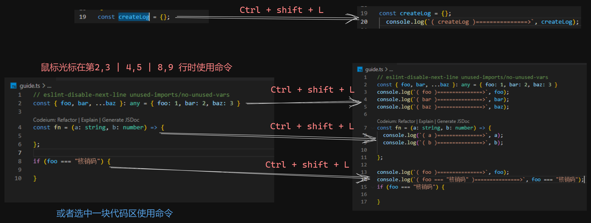

<p align="center">
  
  <!--  -->
</p>

<h1 align="center">Quick Create log</h1>

<p align="center">
  English | <a href="https://github.com/xiaoyao-Ye/vs-quick-log/blob/main/README.zh-CN.md">Chinese</a>
</p>

## Why

When debugging, you often need to type `log` to generate a `console.log('|', |)` snippet and then type in what you need to print. This is a pain in the ass!

Install this extension by searching `vscode` for `vs-quick-log` or `Quick Create log`, and let it create it for you directly.

Most of the existing extensions of the same type need to move the cursor near the declared variable, the advantage here is that the cursor in the current line or the next line will recognize the print itself, do not need to intentionally move the cursor or use the mouse to click on it

## Features

To use, move the cursor to the print target line (or to the next line of the print target).

- `Ctrl + Shift + L` Create `console.log`
  - ✨ You can print "conditional judgment in an if statement"
  - ✨ You can print function parameters
  - ✨ You can print variable names
- `Ctrl + Shift + DELETE` Delete the `console.log` created by the plugin.

> Supports use within `ts` `tsx` `js` `jsx` `vue` `html` files.


<!--  -->

## Mac

> mac Use cmd

- `Cmd + Shift + L` Create `console.log`
- `Cmd + Shift + L` Delete the `console.log` created by the plugin.

## More

- To print variables like `this.xx.xx` `obj.xx.xx`, you need to select the contents and then use the print command.
- To print a large `console.log`, you can select all the lines you want to print and use the print command.

## FAQ

1. The current line with both variables and parameters only creates a `console.log` of the parameters?

   > This is intentional, if there are both variables and parameters in the same line of code there is a high probability that the line is a function expression, in this case we generally need to debug the parameters rather than the function.

   ```javascript
   const fn = (a, b) => {
     // Here it is usually necessary to print a, b instead of fn.
   };
   ```

[Feel free to ask questions or pull requests](https://github.com/xiaoyao-Ye/vs-quick-log)

## License

MIT
